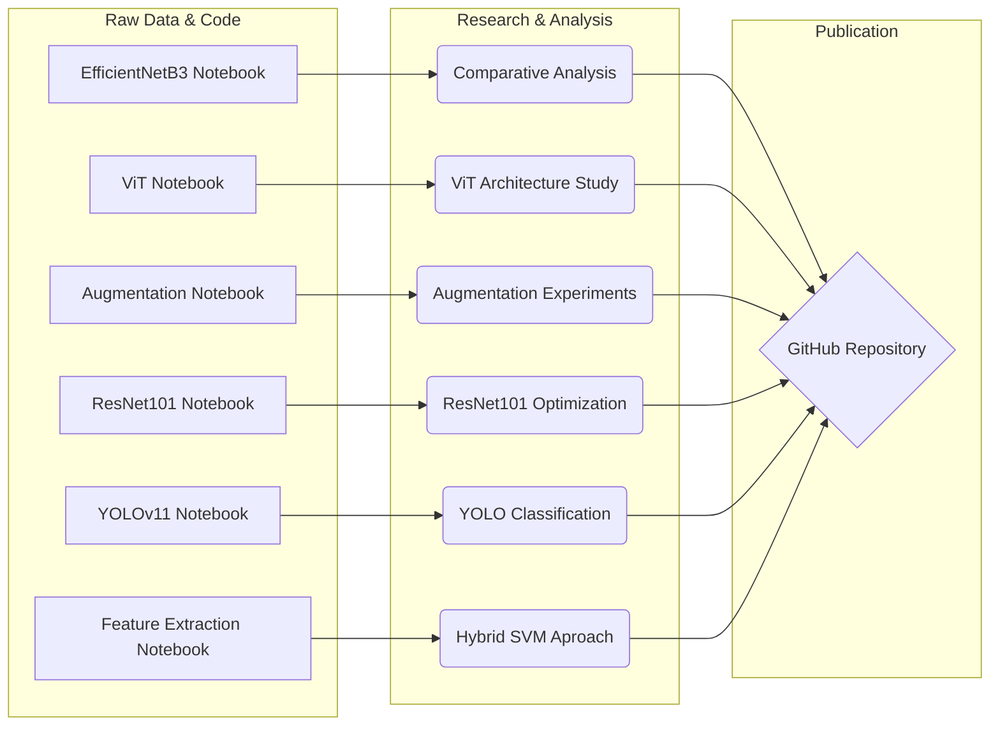

# Project Workflow Overview

Here is a visual summary of the work completed:

```mermaid
graph LR
    subgraph Inputs [Raw Data & Code]
        NB1[EfficientNetB3 Notebook]
        NB2[ViT Notebook]
        NB3[Augmentation Notebook]
        NB4[ResNet101 Notebook]
        NB5[YOLOv11 Notebook]
        NB6[Feature Extraction Notebook]
    end

    subgraph Process [Research & Analysis]
        direction TB
        A1(Comparative Analysis)
        A2(ViT Architecture Study)
        A3(Augmentation Experiments)
        A4(ResNet101 Optimization)
        A5(YOLO Classification)
        A6(Hybrid SVM Aproach)
    end

    subgraph Destination [Publication]
        GH{GitHub Repository}
    end

    NB1 --> A1
    NB2 --> A2
    NB3 --> A3
    NB4 --> A4
    NB5 --> A5
    NB6 --> A6

    A1 --> GH
    A2 --> GH
    A3 --> GH
    A4 --> GH
    A5 --> GH
    A6 --> GH
```
